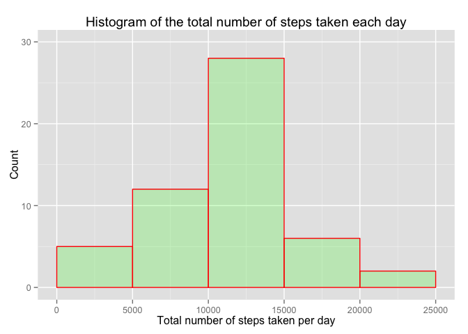
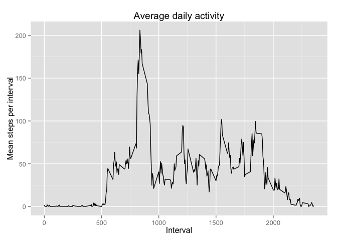
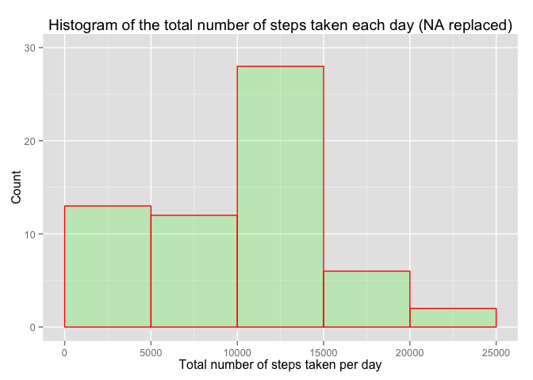
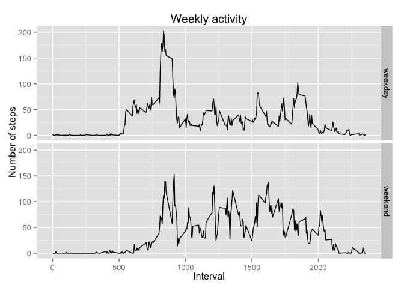

# Reproducible Research: Peer Assessment 1


## 1. Loading and preprocessing the data

The first step to perform is to load the original dataset into a data frame.

```r
dataFile <- "./activity.csv"
data <- read.csv(file=dataFile, head=TRUE, sep=",")
dataObs <- dim(data)[1]
dataCol <- dim(data)[2]
nameCol1 <- names(data)[1]
nameCol2 <- names(data)[2]
nameCol3 <- names(data)[3]
dataStepsNA <- sum(is.na(data$steps))
dataDateNA <- sum(is.na(data$date))
dataIntervalNA <- sum(is.na(data$interval))
nDays <- nlevels(data$date)
dataDateMonths <- as.factor(strftime(data$date, "%m"))
monthOneChar <- levels(dataDateMonths)[1]
monthTwoChar <- levels(dataDateMonths)[2]
monthOne <- month.name[as.integer(monthOneChar)]
monthTwo <- month.name[as.integer(monthTwoChar)]
```

The dataset has  17568 observables of 3 variables, *steps*, *date*, and *interval*. There are 2304 missing observables (NA) in the first variable, steps. The second and third variables, *date*, and *interval*, have 0 and 0 missing observables, respectively. There are 61 levels in the *date* variables, which correspond to the same number of days in the two months of October and November. 

We want now to determine whether the missing observables correspond to a whole day or there are days with partial measurements. This analysis will be partialy used in the section 4.2. (see below).

We convert the second column, *date*, to a Date class:


```r
dataDate <- strptime(paste(data$date), "%Y-%m-%d")
```


```r
dailyMeasurements <- (60/5)*24
dailyNA <- tapply(is.na(data$steps), data$date, FUN=sum)
daysNAonly <- sum(dailyNA == dailyMeasurements)
daysNApartial <- nDays - sum((dailyNA == dailyMeasurements) | (dailyNA == 0))
```
There should be 288 records every day. However, in some of the days the device was stoped and did not saved any data. There are 8 days with no record and 0 days when the device worked only partialy.

## 2. Evaluate the mean total number of steps taken per day


```r
options(scipen=1, digits=2)
library(ggplot2)

dataClean <- droplevels(na.omit(data))
totalStepsDaily <- tapply(dataClean$steps, dataClean$date, FUN=sum)
totalStepsDailyDF <- data.frame(totalStepsDaily)
ggTotalStepsDaily <- ggplot(data=totalStepsDailyDF, aes(x=totalStepsDaily))
ggTotalStepsDaily + geom_histogram(col="red", fill="green", alpha=.2, binwidth=5000) + 
    labs(title="Histogram of the total number of steps taken each day", 
         x="Total number of steps taken per day", y="Count") + 
    xlim(c(0,25000)) + ylim(c(0,30))
```

 

```r
meanTSD <- mean(totalStepsDailyDF$totalStepsDaily)
medianTSD <- median(totalStepsDailyDF$totalStepsDaily)
```

The **mean** and **median** total number of steps taken per day are 10766.19 and 10765, respectively.

## 3. Inspection of the average daily activity pattern


```r
daysStepRecors <- nDays - daysNAonly

tIntMean <- vector(mode="integer", length=0)
for(j in 1:dailyMeasurements)
{
    tInt <- vector(mode="integer", length=0)
    for(i in 1:daysStepRecors)
    {
        tInt <- append(tInt, dataClean$steps[j+(i-1)*dailyMeasurements], after=length(tInt))
    }
    tIntMean <- append(tIntMean, mean(tInt), after=length(tIntMean))
    rm(tInt)
}

temp01 <- dataClean$interval[1:dailyMeasurements]
dailyActivity <- data.frame(temp01, tIntMean)
names(dailyActivity) <- c("interval", "stepIntervalMean")
rm(temp01)
rm(tIntMean)

ggplot(dailyActivity, aes(interval, stepIntervalMean)) + geom_line() + 
    labs(title="Average daily activity", x="Interval", y="Mean steps per interval")
```

 

```r
intervalMaxSteps <- dailyActivity$interval[which.max(dailyActivity$stepIntervalMean)]
```

The 5-minute interval, averaged across all the days in the dataset, that contains the maximum number of steps is 835, or to be more exactly, between 835 and 840.

## 4. Imputing missing values


```r
dataStepsNA <- sum(is.na(data$steps))
```
### 4.1. Total number of missing values
There are 2304 missing values (out of 17568) in the dataset.

### 4.2. Analysis of the missing values in the dataset

Because all the days with missing values have no observable saved (see the discussion in the last paragraph of the first section, especially the variable "daysNApartial"), we will replace the missig values, NA, with 0 (zero), which is also the daily averaged number of steps for the days with missing measured steps. 

### 4.3. Replacing the missing values in the dataset


```r
dataNAreplaced <- data
dataNAreplaced$steps[is.na(dataNAreplaced$steps)] <- 0
```

### 4.4. Histogram and mean and median of the dataset with NA replaced


```r
totalStepsDailyNAreplaced <- tapply(dataNAreplaced$steps, dataNAreplaced$date, FUN=sum)
totalStepsDailyNAreplacedDF <- data.frame(totalStepsDailyNAreplaced)

ggplot(data=totalStepsDailyNAreplacedDF, aes(x=totalStepsDailyNAreplaced)) + 
    geom_histogram(col="red", fill="green", alpha=.2, binwidth=5000) + 
    labs(title="Histogram of the total number of steps taken each day (NA replaced)", 
         x="Total number of steps taken per day", y="Count") + xlim(c(0,25000)) + 
    ylim(c(0,30))
```

 

```r
meanTSDnaReplaced <- mean(totalStepsDailyNAreplacedDF$totalStepsDailyNAreplaced)
medianTSDnaReplaced <- median(totalStepsDailyNAreplacedDF$totalStepsDailyNAreplaced)
```
The **mean** of the total number of steps taken per day calculated from the dataset with NA replaced is 9354.23, compared to a value of 10766.19, calculated from the dataset with NA removed.

The **median** of the total number of steps taken per day calculated from the dataset with NA replaced is 10395, compared to a value of 10765, calculated from the dataset with NA removed.

It can be observed that the values of the **mean** is lower when calculated from the dataset with the NA replaced compared to the dataset with the NA removed, and this is because we will have to divide by a larger number of days (61) in the former case compared to the latter database (53).

The **median** is lower when calculated from the dataset with the NA replaced compared to the dataset with the NA removed.

## 5. Differences in activity patterns between weekdays and weekends


```r
dataNAreplaced$date <- strptime(paste(dataNAreplaced$date), "%Y-%m-%d")
dataNAreplaced$weekDay <- weekdays(dataNAreplaced$date)

dataObsBis <- dim(dataNAreplaced)[1]

for(i in 1:dataObsBis)
{
    if ((dataNAreplaced$weekDay[i] == "Monday")    |
        (dataNAreplaced$weekDay[i] == "Tuesday")   |
        (dataNAreplaced$weekDay[i] == "Wednesday") |
        (dataNAreplaced$weekDay[i] == "Thursday")  |
        (dataNAreplaced$weekDay[i] == "Friday")) {
        dataNAreplaced$weekDay[i] <- "weekday"
    } else if ((dataNAreplaced$weekDay[i] == "Sunday") | 
               (dataNAreplaced$weekDay[i] == "Saturday")) {
        dataNAreplaced$weekDay[i] <- "weekend"
    }
}

dataNAreplaced$weekDay <- factor(dataNAreplaced$weekDay)
nDaysBis <- nlevels(factor(as.character(dataNAreplaced$date)))

viWeekDayMean <- vector(mode="integer", length=0)
viWeekEndMean <- vector(mode="integer", length=0)
for(j in 1:dailyMeasurements)
{
    viWeekDay <- vector(mode="integer", length=0)
    viWeekEnd <- vector(mode="integer", length=0)
    for (i in 1:nDaysBis) 
    {
        if (dataNAreplaced$weekDay[j+(i-1)*dailyMeasurements] == "weekday") {
            viWeekDay <- append(viWeekDay, 
                                dataNAreplaced$steps[j+(i-1)*dailyMeasurements],
                                after=length(viWeekDay))
        } else if (dataNAreplaced$weekDay[j+(i-1)*dailyMeasurements] == "weekend"){
            viWeekEnd <- append(viWeekEnd, 
                                dataNAreplaced$steps[j+(i-1)*dailyMeasurements], 
                                after=length(viWeekEnd))
        }
    }
    viWeekDayMean <- append(viWeekDayMean, mean(viWeekDay), 
                            after=length(viWeekDayMean))
    viWeekEndMean <- append(viWeekEndMean, mean(viWeekEnd), 
                            after=length(viWeekEndMean))
    rm(viWeekDay)
    rm(viWeekEnd)
}

temp02 <- dataNAreplaced$interval[1:dailyMeasurements]
tempDay <-rep("weekday", dailyMeasurements)
tempEnd <-rep("weekend", dailyMeasurements)
weeklyActivity <- data.frame(c(temp02, temp02), c(viWeekDayMean, viWeekEndMean),
                             c(tempDay, tempEnd))
names(weeklyActivity) <- c("interval", "stepIntervalMean", "dayKind")
ggplot(weeklyActivity, aes(interval, stepIntervalMean)) + geom_line() + 
    labs(title="Weekly activity", x="Interval", y="Number of steps") + 
    facet_grid(dayKind ~ .)
```

 


